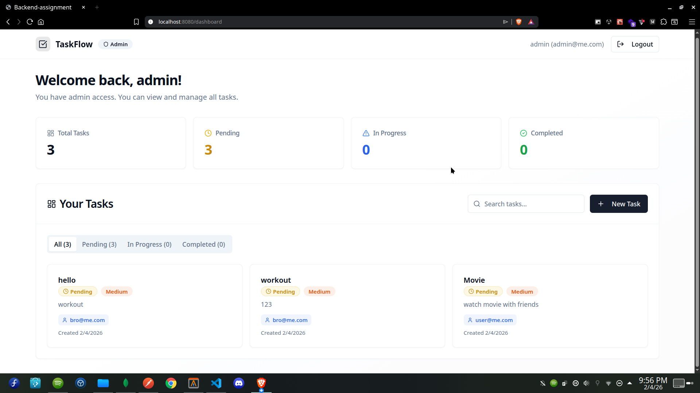
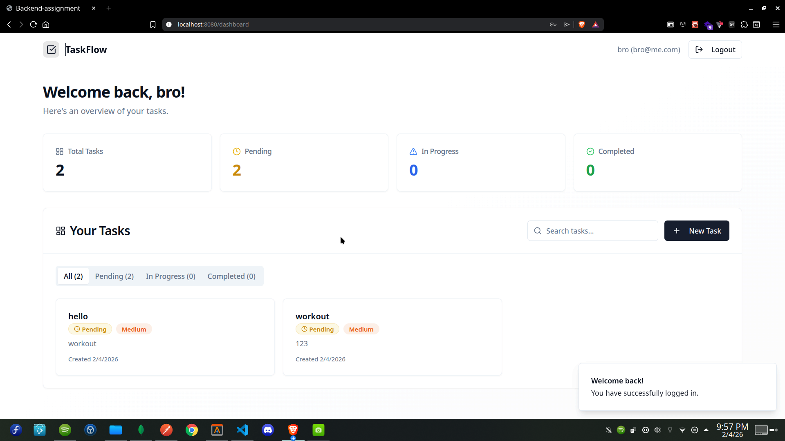
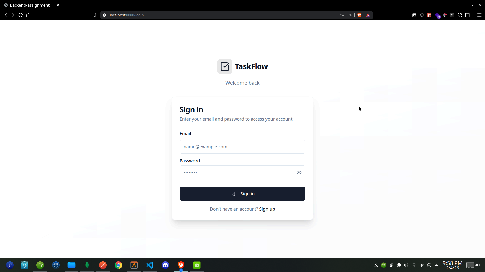
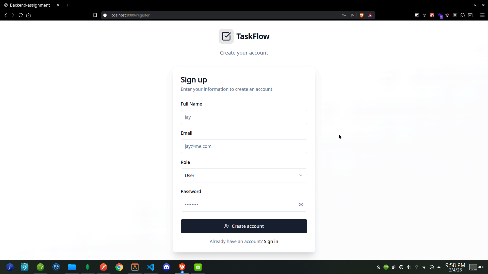

### Backend Developer Intern Assignment – Scalable Auth & Task API

### Live Links

- **Frontend UI (Vercel):** https://backendassign-1jay.vercel.app
- **Backend API (Render):** https://mega-backend-eamr.onrender.com/
- **API Documentation (Swagger):** https://mega-backend-eamr.onrender.com/task/api-docs

### Tech Stack

- **Backend:** Node.js, Express.js
- **Database:** MongoDB
- **Authentication:** JWT (JSON Web Tokens) & Bcrypt for password hashing
- **Frontend:** React.js
- **API Documentation:** Swagger
- **Deployment:** Render (Backend), Vercel (Frontend)

### Security & Authentication

- **Secure Registration/Login:** Password hashing using Bcrypt.
- **JWT Authentication:** Stateless authentication using Bearer tokens.
- **Role-Based Access Control (RBAC):** Differentiated access for `User` and `Admin` roles.
- **Protected Routes:** Middleware-level authorization to secure sensitive endpoints.

---

